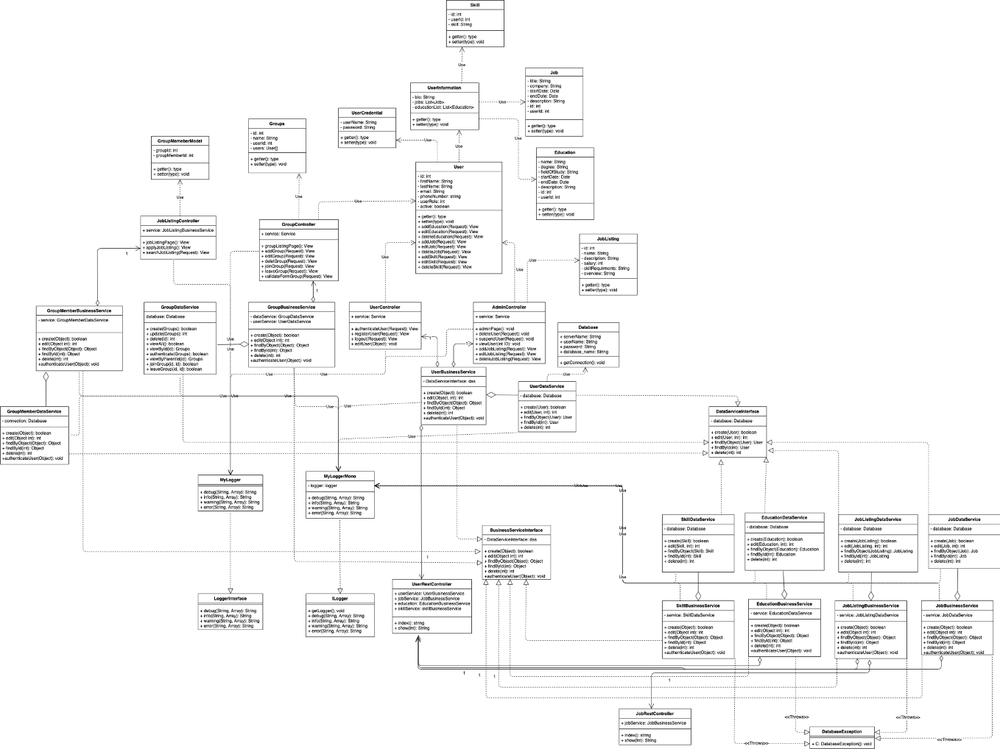
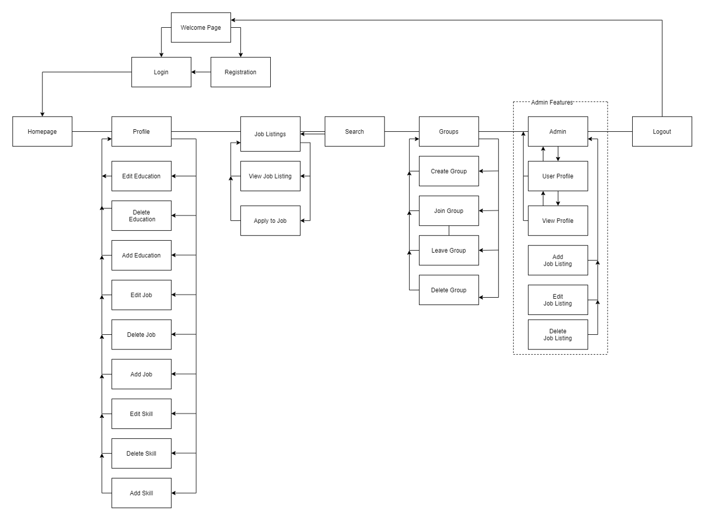
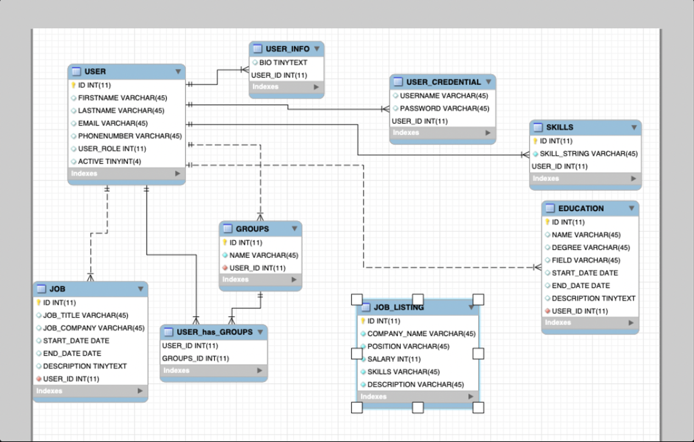
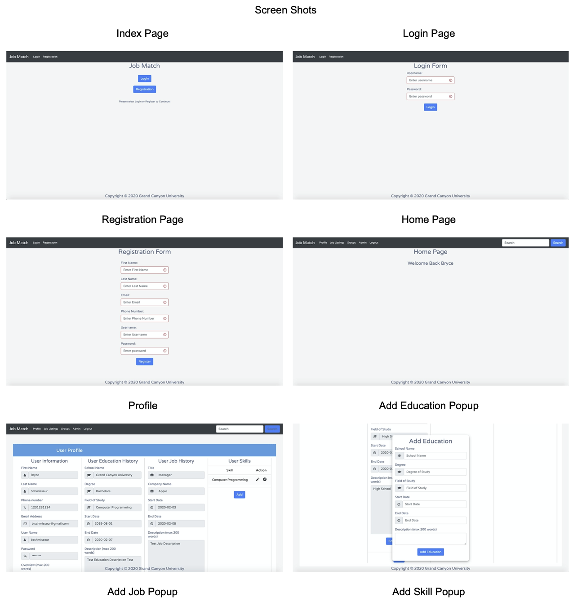

# Job Match PHP Laravel
My partner and I were tasked to create a Laravel based application in which a user can search through job listings and maintian a profile in order to apply for jobs. This application was based off LinkedIn utilizing features given by laravel such as security, middleware, and blade. Also this application provides a REST API for the users and job listings that are in the database for the application.

<h3>Technologies Used:</h3>
PHP: PHP 7.3.11 
Server: MAMP 5.3 
IDE: Eclipse IDE for PHP Developers 2019-12 

<h3>Documentation</h3>
<h4>UML Class Diagram</h4>

	

<h4>Sitemap Diagram</h4>

	

<h4>ER Diagram</h4>

	

<h4>Final Product</h4>

	
  

<h3>Rest API Documentation</h3>
Rest API Users: https://app.swaggerhub.com/apis/hermesmimini/JobMatch/1.0 
Rest API Job Listings: https://app.swaggerhub.com/apis/hermesmimini/JobMatch1/1.0
